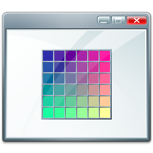

# Color_SetOfColors
- Use a Set to Collect Colors From a ListBoxColor.
                                                             
 

# Features  
- Using LiveBindings to Display Color.
- Using Set Operators to joins two Sets.

## Files

| File | Contents | 
| --- | --- |
| .gitignore | Git ignores the files in this file |
| uAbout.pas | About view of the programme |
| uMain.pas | Main view of the programme |
| SetOfColors.dpk | The compiler project file |
| SetOfColors.dproj | The MSBUILD project file |
| README.md | The readme for this project |
