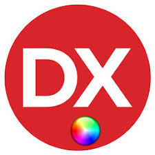

# Delphi-Collection-Color
My Own Delphi-Collection ( Color ) 

**Authors:**  *WalWalWalides*
------

## Contains

| File | Contents | 
| --- | --- |
| .gitignore | Git ignores the files in this file |
|[Color_SetOfColors](https://github.com/walwalwalides/Delphi-Collection-Color/tree/master/Color_SetOfColors)| Use a Set to Collect Colors From a ListBoxColor|
|[Color_clConverter](https://github.com/walwalwalides/Delphi-Collection-Color/tree/master/Color_clConverter)| Convert HEX Color To HTML Color Code|
| README.md | The readme for this project|

------

# If You Want To Donate!

